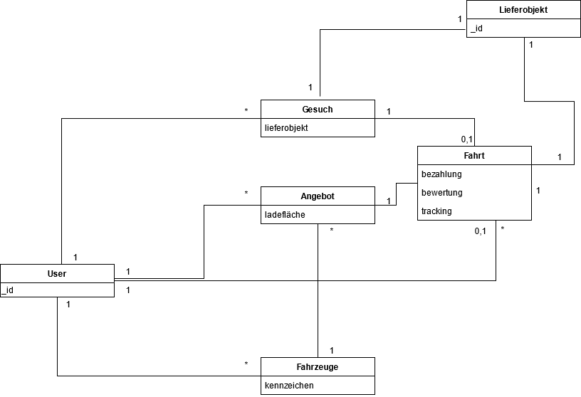

# *MyCargonaut*
###### *CS2016 Konzepte moderner Softwareentwicklung - Wintersemester 2020/2021*

## Build Status

## Contributors

## Content
* [Installation](#installation)
* [Technology stack](#technology-stack)
* [Infrastructure](#infrastructure)
* [Domain model](#domain-model)
* [Class diagram](#class-diagram)
* [Wireframe](#wireframe)
* [Mockup](#mockup)

## Installation
To install the dependencies, run ``npm i``.

To start the app, run ``npm run ion`` in the root folder.

## Testing
**Before commiting** to the repository, run the following scripts.
* Run ``npm run test`` for unit testing.
* Run ``npm run e2e`` for end-to-end testing.
* Run ``npm run lint`` to find linting issues.
  
* *Optional:* Run ``npm run coverage`` to observe test coverage.

**Testing Strategy:** White-box-tests (unit testing)

## Deployment
When pushing to the main branch ``release``, the Travis bot will automatically commit the changes
to the ``gh-pages`` branch and deploy the app to [MyCargonaut](https://spahno.github.io/MyCargonaut).

## Technology stack
Technology | Usage
---------------------|----------
[WebStorm](https://www.jetbrains.com/webstorm) | IDE
[Ionic](https://ionicframework.com) | Cross-Platform Mobile App Development
[Angular](https://angular.io) | Frontend Development
[Firebase Firestore](https://firebase.google.com/docs/firestore) | Database (Cloud Firestore)
[Firebase Storage](https://firebase.google.com/docs/storage) | Database (Storage)
[Google People API](https://developers.google.com/people) | Authentication
[Travis CI](https://travis-ci.org) | Continuous Integration
[Hound CI](https://houndci.com) | Continuous Integration
[Github Pages](https://pages.github.com) | Deployment

## Infrastructure
**GitHub - GitHub Pages - Travis CI**

## Domain model
]

## Class diagram
Lorem Ipsum

## Wireframe
[Wireframes in Adobe XD](https://xd.adobe.com/view/3972f6df-4178-426e-bcd4-7858681e2eda-6c21/?fullscreen)
## Mockup
[Mockup in Adbobe XD](https://xd.adobe.com/view/f2ef1bff-8858-4cd0-b83e-3012263a7b20-a7bc/?fullscreen)

